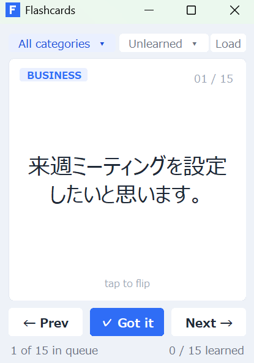

# English Flashcard App

Claude（AI）との対話だけで作ったシンプルな英語フラッシュカードアプリです。  
バイブコーディングの練習として作ってみました。

## スクリーンショット



## 特徴

- CSV ファイルからカードを読み込んで学習
- 英語 ↔ 日本語 をワンクリックでめくる
- カテゴリ別フィルタリング
- 覚えたカードを「学習済み」にして除外 → 減っていく達成感
- カテゴリ単位 or 全件での学習リセット
- 進捗バーで学習率を可視化
- ウィンドウを画面右下にスナップするコンパクトモード

## 動作環境

- Python 3.8 以上
- tkinter（Python 標準ライブラリ、追加インストール不要）

## 使い方

```bash
python flashcard.pyw
```

起動すると同フォルダの `cards.csv` を自動で読み込みます。  
別のファイルを使いたい場合は画面右上の **Load** から選択してください。

### キーボードショートカット

| キー | 操作 |
|------|------|
| `Space` | カードをめくる（英語 ↔ 日本語） |
| `←` / `→` | 前 / 次のカード |
| `Enter` | 学習済みにする（Got it） |
| `F1` | ヘルプを表示 |

## CSV フォーマット

`cards_sample.csv` を参考にしてください。

| 列名 | 説明 |
|------|------|
| english | 英語のフレーズ |
| japanese | 日本語訳 |
| category | カテゴリ名（例: business, travel, daily） |
| active | 1 で有効、0 でスキップ |
| learned | 1 で学習済み（Got it を押すと自動更新） |

```csv
english,japanese,category,active,learned
Could you send me the report by Friday?,金曜日までにレポートを送っていただけますか？,business,1,0
```

## About

このアプリは Claude（Anthropic）との会話だけで作成しました（バイブコーディング）。  
コードを一行も手書きせずに、ここまで作れるんだという実験でもあります。
